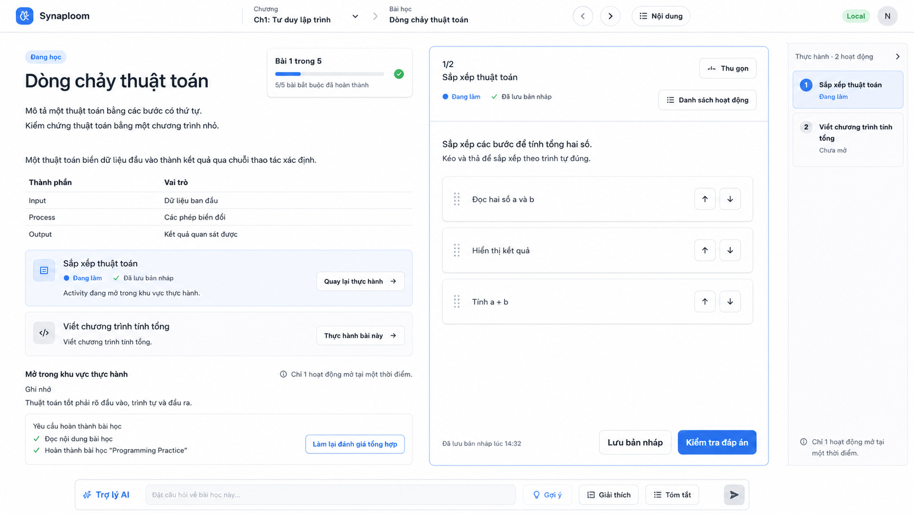

# Single Active Workspace UI Design

**Status:** Approved
**Date:** 2026-07-20
**Target:** Dual-Surface Learning Workspace refinement
**Supersedes:** Inline-editing and return-inline behavior in `2026-07-19-dual-surface-learning-workspace-design.md`

## 1. Decision

Synaploom will use the **Single Active Workspace** interaction model.

At any moment, exactly one activity may expose editable controls. The focused activity is rendered only in the Practice Pane. Its authored location inside the lesson remains visible as a read-only activity summary and navigation affordance.

This rule applies consistently to every Activity Engine kind, including quizzes, ordering, matching, writing, coding, and assessment questions.



The image is a visual direction, not a pixel-perfect implementation contract. The behavioral and layout requirements below are authoritative.

## 2. Product goals

The refinement must:

- establish one predictable place for active work;
- prevent duplicate editors and competing calls to action;
- keep lesson theory visible while an activity is open;
- preserve a stable reading width across activity changes;
- make expanded, split, collapsed, compact, and mobile presentations feel like states of one workspace;
- keep activity status, saving, navigation, and AI context visually connected to the focused activity.

## 3. Core interaction contract

### 3.1 One live editor

Only `ActivityFocusHost` inside the Practice Pane may mount editable activity controls.

The Theory Pane must never mount a second editable renderer for the same activity. In this design, it also does not mount editable renderers for non-focused activities. All authored activity positions are represented by summary cards.

### 3.2 Activity summary cards

Each authored activity position renders a compact card containing:

- activity icon and title;
- completion or draft status;
- one-line description or focused-state message;
- one primary navigation action.

A focused activity uses language such as:

```text
Sắp xếp thuật toán
Đang làm · Đã lưu bản nháp
Activity đang mở trong khu vực thực hành.

[Quay lại thực hành]
```

A non-focused activity uses language such as:

```text
Viết chương trình tính tổng
Chưa bắt đầu
Viết chương trình tính tổng.

[Thực hành bài này]
```

Summary cards must not contain answer inputs, code editors, drag handles, evaluation controls, terminals, or activity-specific editing widgets.

### 3.3 Opening another activity

Selecting `Thực hành bài này` performs one transaction:

```text
save focused activity if dirty
→ stop if save fails
→ persist the new focused activity
→ open the Practice Pane in the appropriate mode
→ mount the selected activity once
→ scroll the Theory Pane summary into view when appropriate
→ move keyboard focus to the Practice Pane heading
```

### 3.4 Collapsing Practice

Collapsing hides the live editor but preserves the focused activity, draft, and workspace state.

The desktop collapsed state uses a narrow Practice Rail, approximately 52–56 px when represented as an icon rail, or a compact information rail when sufficient width exists. It must not reserve a large empty panel.

Selecting the rail restores the same activity and its previous pane mode.

There is no “return inline editor” action. The authored location remains a summary card in all modes.

## 4. Desktop layout

### 4.1 Open split mode

The desktop workspace consists of:

- **Theory Pane:** approximately 55–65% of available workspace width;
- **Practice Pane:** remaining width, subject to minimum usable dimensions;
- optional compact Activity Tray or activity-list control associated with Practice.

The Theory Pane keeps a stable reading measure. Opening or changing an activity must not cause dramatic typography reflow beyond the intentional pane resize.

Theory and Practice own independent scroll containers. Neither pane may expand to document height and become clipped by the application shell.

### 4.2 Theory Pane hierarchy

The Theory Pane contains, in order:

1. learning-state indicator;
2. lesson title and concise introduction;
3. progress summary;
4. lesson content and reference material;
5. activity summary cards at their authored positions;
6. lesson completion requirements and progression actions.

The active summary card receives a restrained highlighted state. It must remain less visually dominant than the live Practice Pane.

### 4.3 Practice Pane hierarchy

The Practice Pane contains:

1. activity position, such as `1/2`;
2. activity title;
3. activity status and draft-save state;
4. collapse and activity-list controls;
5. activity instructions;
6. the single editable activity renderer;
7. feedback or evaluation region;
8. sticky or reliably reachable action bar.

The header and action bar must remain understandable for all activity kinds. Activity-specific tools belong inside the renderer, not in shell-level navigation.

### 4.4 Activity Tray

The activity list shows authored order and status. It may appear as a narrow rail, popover, drawer, or contained side list depending on available width.

The list must not create an additional full-width blank column. Selecting an item uses the save-before-switch transaction.

## 5. Compact and mobile behavior

### 5.1 Compact desktop and tablet

Theory and Practice become two controlled surfaces selected by tabs or a segmented switch. Only one surface is prominent at a time, but both use the same controller and persisted focused activity.

### 5.2 Mobile

Practice opens as a full-screen sheet or route-like surface within the learning shell. Closing it returns to Theory without clearing focus or draft state.

The summary card remains the re-entry point. The mobile surface must not mount a second editor underneath the sheet.

## 6. Contextual AI assistant

The AI assistant is a compact contextual dock, drawer, or sheet rather than a large disconnected footer panel.

It always exposes its current context:

- `Bài học: Dòng chảy thuật toán`, or
- `Hoạt động: Sắp xếp thuật toán`.

When Practice is active, activity context is the default. The assistant must not obscure the Practice action bar or consume permanent vertical space that prevents either pane from scrolling.

## 7. Visual system

The implementation should preserve Synaploom’s restrained visual language:

- white and neutral surfaces;
- blue as the primary action and focus accent;
- green only for success or saved states;
- subtle borders and shadows;
- consistent 8 px-derived spacing rhythm;
- moderate corner radii;
- clear type hierarchy with accessible contrast;
- status communicated by text and icon, never color alone.

The Practice Pane may use a slightly differentiated background or border, but it should remain part of the same application surface rather than look like a separate embedded product.

## 8. State and error behavior

- Draft-save state is visible near the activity title and action bar.
- Save failure keeps the current editor mounted and blocks activity switching.
- Presentation conflict recovery must not remount or reset the active renderer.
- Activity-load failure keeps the Practice Pane open with an inline retry action.
- Collapse, focused activity, split ratio, and expanded state survive refresh and runtime restart.
- Invalid persisted focus collapses safely while preserving usable lesson content.

## 9. Accessibility

- Opening Practice moves focus to its heading after persistence succeeds.
- Switching activities announces the new title and save result.
- Collapsed controls expose `aria-expanded` and `aria-controls`.
- Activity status is available as text.
- Theory and Practice scroll independently with keyboard, wheel, and touch input.
- Focus must not move behind a mobile sheet or compact surface.
- The divider remains keyboard operable in desktop split mode.

## 10. Acceptance criteria

The refinement is complete only when all of the following are true:

1. Exactly one editable activity renderer exists in the DOM.
2. Every authored activity position in Theory renders a summary card, never an editor.
3. Focused and non-focused summaries use distinct, understandable actions.
4. Switching activities saves the current dirty draft before focus changes.
5. Save failure prevents switching and preserves unsaved content.
6. Theory width remains stable within the selected pane ratio.
7. Collapsing Practice does not leave a large empty column.
8. Restoring the rail reopens the same focused activity.
9. Theory and Practice scroll independently at wide, compact, and mobile breakpoints.
10. Coding, ordering, writing, quiz, matching, and assessment activities follow the same shell interaction model.
11. AI assistance clearly indicates lesson or activity context.
12. Focus, collapse state, and split ratio survive refresh and runtime restart.

## 11. Migration impact

The existing dual-surface controller, persistence model, and save lifecycle remain valid. The principal behavioral change is removal of editable inline presentation and removal of the `return inline` transition.

Migration work must:

- convert inline activity renderers to summary cards;
- route every activity-open action through the Practice Pane controller;
- remove or deprecate `allowInline` behavior at the UI layer;
- retain schema compatibility long enough to load existing authored courses;
- map historical inline defaults to collapsed or focused Practice behavior without losing attempts;
- update browser acceptance tests to assert one live editor across all activity kinds.

## 12. Non-goals

This refinement does not introduce:

- multiple simultaneous Practice editors;
- detachable windows;
- collaborative editing;
- a new activity attempt model;
- a new persistence backend;
- a pixel-identical recreation of the approved mockup.
